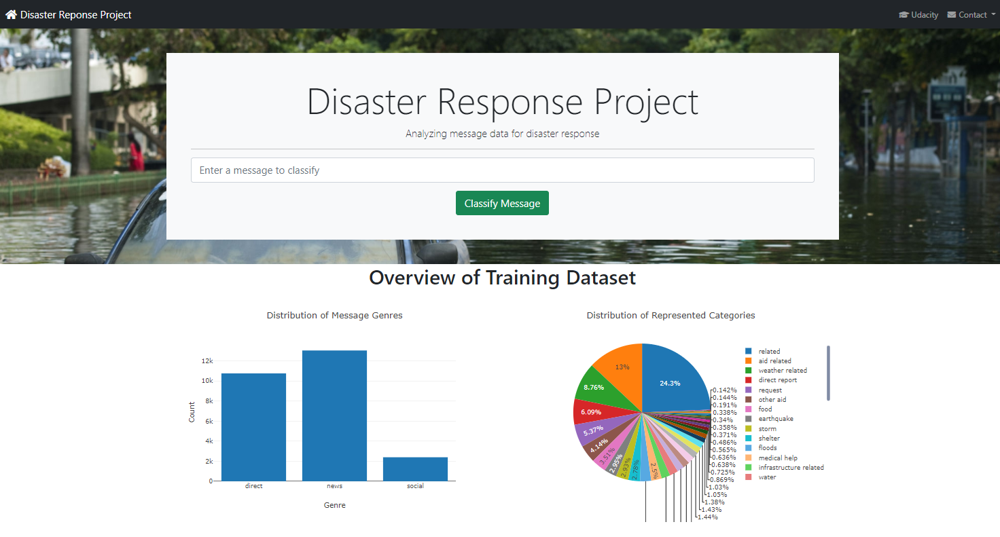
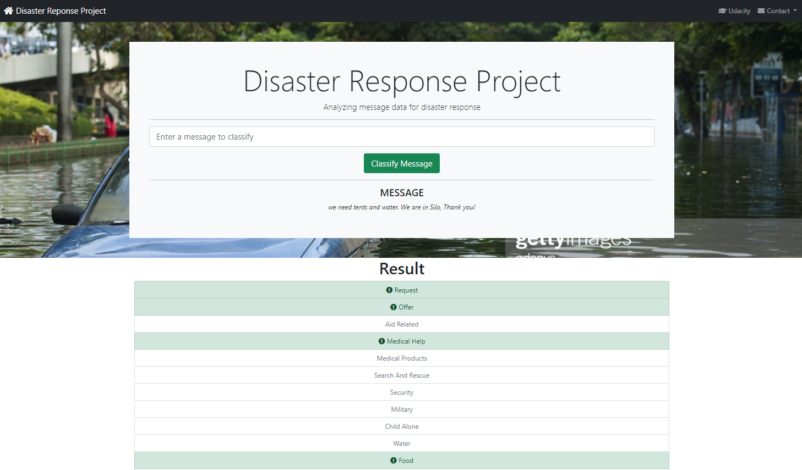

# Project2-Udacity-Data-Scientist
As part of the udacity.com Data Scientist nanodegree, this is project two of the program. Following a disaster, there are millions of tweets, news alerts, or social media and online messages that are generated. During this critical time, organizations are overwhelmed with data and they need to filter out what is pertinent information from what is just noise. One response organization might be interested in information about water needs, or roads, or medical supplies, etc. But is someone just commenting on water or urgently asking for clean water needs without using the word water? 

There is not enough time for a person to parse through so much data in time for the correct organization to respond effectively. One in every 1,000 messages might actually be important.

Figure Eight, a company specializing in AI data solutions, has provided real social media and online messages that were generated in an actual emergency that will be used for this project.

This project involves a Disaster Response Pipeline dashboard web application showcasing the following Data Science and Software Engineering Best Practices:

* Github and Code Quality including this repository along with comments, docstring in each function, class, or method, unit tests, and logical functions and PEP8 style guideline conventions
* ETL or Extract Transform Load data setup of a clean dataset
* Machine Learning including NLP techniques to process text data and the proper use of pipelines and grid search, traning vs. test data, and model evaluation
* Deployment of our web application showing our Disaster Response Pipeline visualizations

As in my previous project, I have also documented the work in the blog below:

#### My BLOG is HERE: https://hmelendez001.github.io/2021/11/19/Udacity-Data-Scientist-Nanodegree-Project-2.html

# How to Run the Python Scripts
From the root folder run the following python command to process and clean the raw data:

##### &nbsp;&nbsp;&nbsp;&nbsp; python data/process_data.py data/disaster_messages.csv data/disaster_categories.csv data/DisasterResponse.db
Altenatively, to capture run times, from the root folder run the following python command with the time -v prefix:

##### &nbsp;&nbsp;&nbsp;&nbsp; time -v python data/process_data.py data/disaster_messages.csv data/disaster_categories.csv data/DisasterResponse.db

From the root folder run the following python command to train and save the model:

##### &nbsp;&nbsp;&nbsp;&nbsp; python models/train_classifier.py data/DisasterResponse.db models/classifier.pkl
Altenatively, to capture run times, from the root folder run the following python command with the time -v prefix:

##### &nbsp;&nbsp;&nbsp;&nbsp; time -v python models/train_classifier.py data/DisasterResponse.db models/classifier.pkl

# How to Run the Web Application
From the app folder run the following python command:

##### &nbsp;&nbsp;&nbsp;&nbsp; python run.py
---
You should see something like this on a local browser

---
Alternatively you can run my Heroku cloud web installation here: https://helderdisasterdash.herokuapp.com/

From the dashboard landing page type a test message like **we need tents and water. We are in Silo, Thank you!** into the input text fields that reads _Enter a message to classify_. Click the "Classify Message" button and you should see something like the following. Notice it shows the categories for your message, if any: 

---

---

# Libraries Used
| Library | Description |
| :--- | :--- |
| Bootstrap | This toolkit was used to simplify writing the HTML5 elements including CSS styles in our web application |
| Flask | This Python micro web framework was used to write the backend of our web application dashboard |
| Gunicorn | This is needed for web application deployment |
| Heroku | This is used to access the hosting platform |
| JQuery | This is the javascript for manipulating objects on the UI web application dashboard |
| Json | This is the package for manipulating JSON text and objects |
| NLTK | This is used by the machine learning pipeline to do the text processing |
| Numpy | This is where numerical constants like np.nan came from|
| Pandas | This is the work horse behind our analysis for reading in the DataFrame from the CSV file and performing various data analysis and preparation |
| Pickle | This is the utility used to store the trained and optimized model for reuse by the UI web application dashboard |
| Plotly | This was the graphing library used to generate our visualizations |
| Re | This is the Regular Expression package used for manipulating strings with regex |
| Sklearn | This is the scikit-learn's Pipeline and GridSearchCV used to build and run our machine learning model |
| Sqlalchemy | This is the SQLite database package used to write and read to and from the SQL database |

# Files in this Repository
| File | Description |
| :--- | :--- |
| app | The dashboard or web application main directory |
| app > templates | Directory with the HTML files for the web application |
| app > templates > go.html | Page which displays the classification results of the web application |
| app > templates > master.html | The main page or the landing of the web application |
| app > run.py | The Flask file that runs the web application |
| data | The directory contaning the raw data for this project along with the scripts to run the ETL pipeline |
| data > DisasterResponse.db | The SQL Lite connection file |
| data > disaster_categories.csv | The raw data containing the disaster organization categories to process |
| data > disaster_messages.csv | The raw online messages to process |
| data > process_data.py | A data cleaning pipeline that loads the messages and categories datasets from the raw data, merges the two datasets, cleans the data, and stores it in a SQLite database using an SQLAlchemy engine |
| data > InsertDatabaseName.db | The SQLite3 database to save the clean data |
| models | The directory contaning the scripts to run the Text Processing, Natural Language Processing (NLP), and Machine Learning (ML) pipelines |
| models > train_classifier.py | A machine learning pipeline that loads data from a SQLite database, splits the dataset into training and test datasets, builds a text processing and machine learning pipeline, trains and tunes a model using GridSearchCV, outputs results on the test set, and exports the final model as a pickle file |
| models > classifier.pkl | The saved model pickle file |
| nltk.txt | This will tell Heroku to automatically download the modules in this file and install them into our application at build time |
| Procfile | Instructs the runtime to use gunicorn to run our dashboard |
| README.md | The file you are currently reading |
| requirements.txt | Contains the list of required libraries, a subset of those listed in the "Libraries Used" section above but includes the versions required at run time. This was generated using pipreqs as follows:
**pip install pipreqs**
**pipreqs .** |
| runtime.txt | The Python runtime version being used |

# How to Deploy to the Heroku Hosting Platform
| Step | Command | Description |
| :--- | :--- | :--- |
| 1 | mkdir web_app | Create a folder to contain all the assets to deploy |
| 2 | cp -R <root folder path of this project> web_app | Copy all the files in this project to the web_app folder you created in step 1 |
| 3 | heroku --version | Verify the Heroku installation | 
| 4 | curl https://cli-assets.heroku.com/install-ubuntu.sh \| sh | Install the necessary Heroku assets using their installation script | 
| 5 | heroku login -i | Assuming you have a Heroku account already, if not go to heroku.com and set up your account then issue this command to login with your credentials |
| 6 | git init
git config --global user.email "you@example.com"
git config --global user.name "Your Name" | Initialize a git repository with these ONE-TIME commands, if you do not already have one in Heroku |
| 7 | cd web_app
cp -R app/templates .
cp app/run.py . | You will need to move the app contents to the root folder so that Heroku will find it at runtime, also you will need to update this version of run.py in web_app to not include host='0.0.0.0', port=3001, debug=True in the main function, simply call app.run() instead |
| 8 | git add .
git status
git commit -m "your message" | Use this chain of command to commit your files to the Heroku git repository |
| 9 | heroku create my-app-name --buildpack heroku/python | Create a uniquely named Heroku app using this command. If you get a message that the app name is already taken, try again with a different app name until you find one that is not taken |
| 10| git remote -v | Check that heroku added a remote repository with this command |
| 11 | heroku config:set SLUGIFY_USES_TEXT_UNIDECODE=yes
heroku config:set AIRFLOW_GPL_UNIDECODE=yes
heroku config
git push heroku master | Set any environment variable to pass along with the deployment and push the app to Heroku |
| 12 | From a web browser go to the link for your as named in step 8 above, something like https://app-name.heroku.com | Confirm your app is running on Heroku |

# Summary of the results
The dataset given was imbalanced (i.e. some labels like water have few examples and others like search_and_rescue, security, child_alone, shelter, clothing, etc. had none). We discovered this when first evaluating our model and seeing Scikit warnings that read "UndefinedMetricWarning: Precision is ill-defined and being set to 0.0 in labels with no predicted samples." This imbalance affected training the model because our overall precision, recall, f1-score were skewed (with so many 0 results the averages were pulled down). Unlike with other data like financials, temperature readings there really is no way to necessarily impute the data. I cannot simply average out these gaps or even do other imputing strategies like fill forward or fill back data. NLP or Natural Language Processing does not give us these imputing options. Best we might do here to get a better evaluation result would be to emphasize the stats on the categories we know are not missing by passing the labels for the categories we do have.
  
Given more time I would have customized the web application dashboard further, using more the fontawesome icons and making the list of selected categories more reactive. Also, I would have included unit tests rather than running code from my Jupyter Notebook to test snippets. And finally I would have made the model pipeline component a module in PyPi.org to avoid repeating code like the tokenize function, the class UrgencyWordExtractor, and some of the other string constants like url_regex, alphanum_regex, and urgent_words.

# Acknowledgements
Several code snippets came from previous lessons in our Udacity Data Scientist program. Also, where employed I have credited various contributors from StackOverflow.com, geeksforgeeks.org at https://www.geeksforgeeks.org/, https://www.tutorialspoint.com/ for sample plotly graphs, and the Data Science Stack Exchange at https://datascience.stackexchange.com. A big thank you to our instructors and all those involved in the Udacity program.
